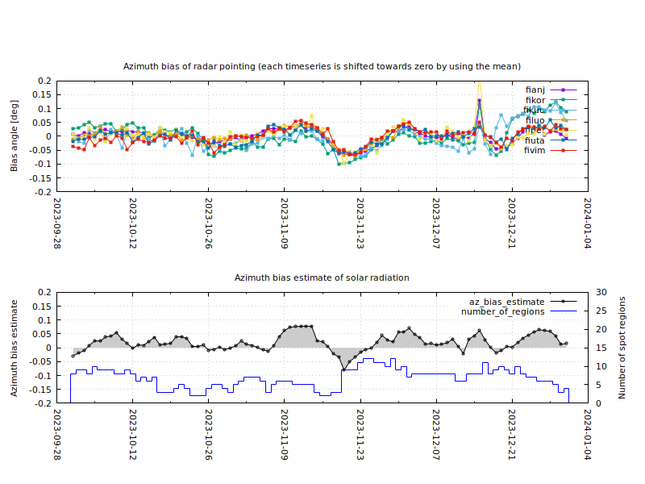

# Sunbias

Sunbias program estimates what is the difference between the mid point of Sun and a center point of radio emission of Sun seen by a weather radar with a narrow beam on Earth. The program calculations are based on active regions data of Sun and their extents. A bias estimate is usefull when Sun is used as a reference point to monitor stability of a weather radar pointing. 


## Introduction

Sun is a radio source that radiates at all frequencies. Over the frequencies of 30 GHz, Sun's flux follows quite well [black-body radiation](https://en.wikipedia.org/wiki/Black-body_radiation) curve of 5777 K. Lower frequencies at weather radar bands, radiation flux is not that stable. Over a period of [solar cycle](https://en.wikipedia.org/wiki/Solar_cycle) from a minimum to a maximum activity, produced [radio emission](https://en.wikipedia.org/wiki/Solar_radio_emission) varies significantly even during quiet sun. Solar flares in active regions are great source of radio emission compared to the background radiation level.

Bacause Sun rotates around its axis, active regions move along the rotation. Near the poles, rotation is slower than at the equator. Active regions also move between poles and equator depending on the state of solar cycle. If there are highly active regions on the edges of Sun's Earth side hemisphere, solar radio bursts change center point of radio emission seen from Earth. The change can be over 0.1 degrees seen from Earth. Concerning the diameter of solar disk is about 0.57 degrees at radio frequencies, the change of center point is significant.

A weather radar pointing can be monitored by using a method called as [solar analysis](https://baltrad.github.io/cookbook/cookbook_SOLARANALYSIS). The method is widely used around the world. Solar analysis is based on sun interferences that are visible in the operational data, if the radar is sensitive enough. The interferences can be extracted from the data and used for monitor beam pointing, beam width and power stability. Calculating a difference of Sun's position and radar pointing (elevation and azimuth angles) for each interference close enough the beam and fitting the values to two dimensional second order polynomial, we get how much radar pointing deviates from the position of the Sun. Sun's location seen at a point on Earth can be calculated by using the formula in [the Guide to Instruments and Methods of Observation, Volume I](https://library.wmo.int/viewer/68695/download?file=8_I-2023_en.pdf&type=pdf&navigator=1), publised by WMO. 

If solar cycle is its minimum, the center point of Sun's radio emission is most likely the same as its calculated position. During a maximum activity, Sun's position varies at radio frequencies. Stable and sensitive enough narrow beam weather radars, can track Sun's position at accuracy of under 0.1 degrees. To be able to distinct between malfunction of radar and variation of the center point of Sun, we need an estimate how much the center point of Sun's radio emission varies every day.


## Data and algorithm

Calculations of the program are based on [Solar Region Summary](https://www.swpc.noaa.gov/products/solar-region-summary) data provided by NOAA. Instead of using daily summary files, the program use [solar_regions.json](https://services.swpc.noaa.gov/json/solar_regions.json) file that is a region summary collection from a month. There is available [a user guide](https://www.swpc.noaa.gov/sites/default/files/images/u2/Usr_guide.pdf) that explains backgrounds of the data.

Bias calculation is quite traightforward.

1. Select regions that fullfill the following rules:
   * regions have a same date
   * there are more than 1 sunspots in the area
   * area is grater than 1 millionth of the solar hemisphere
   * heliographic latitude and longitude of a region are between -90 and 90 degrees.
2. Convert longitudes and latitudes to radians and normalize with sine function.
3. Calculate an extent weighted mean of normalized latitudes and longitudes separately
4. Use [Logistic function](https://en.wikipedia.org/wiki/Logistic_function) with 5 as function's midpoint to attenuate cases with low number of regions.
5. Change sign of result if needed

The sign change is usefull because the elevation and azimuth angles of interference are usually substracted from radars pointing and because the definiton of [Stonyhurst heliographic coordinate system](https://en.wikipedia.org/wiki/Solar_coordinate_systems#Heliographic). 

The Logistic function to attenuate cases with low number of regions is

$$ \frac{1.0}{1.0 + e^{n0-N}} $$

Without the attenuation, a bias estimate might get too high value. The functions's midpoint value $n0 = 5$ seems to attenuate an estimate well enough in azimuth direction, at least when solar activity is near its maximum. Days when there are a high number of regions present, they are most likely distributed to the both side of zero degrees. Even though there are days when they aren't and those are the days when center point of radiation deviates from the center significantly.

Extent weighted mean of heliographic latitudes or longitudes can be calculated with the following equation which is the estimate

$$ \frac{S C}{W N} \sum_{i=1}^N w_i \sin{x_i} $$

Parameters in the equation:
* $x_i$ is a coordinate in radians
* $N$ is number of solar regions
* $w_i$ is extent of the major axis of region in heliographic degrees
* $W$ is sum of extent values of all regions
* $C$ is an attenuation factor calculated by using logistic function
* $S$ is either 1 or -1 that change the sign of result

An estimate value is unitless and between -1 and 1. It might be usefull to scale the estimate to the diameter of solar disk but not yet seen it necessary. There might also be some other functions to use for attenuate bad estimates.

## Analysis and results

Following graph shows how FMI's C-band weather radars' beam pointing bias change in azimuth direction. Lower graph shows estimate values how the center point of solar radiation change each day. 


It is clearly visible that there is a correlation in azimuth direction. Analyzing elevation variation there aren't so good connection when solar cycle is near its maximum and regions are close to the equator. Using sunspot characteristics might be a way to increase the weight of high active reagions over others. For that, deeper knowledge of [sunspot analysis techniques](https://www.ngdc.noaa.gov/stp/space-weather/solar-data/solar-features/sunspot-regions/usaf_mwl/documentation/usaf_sunspot-analysis-techniques_afwaman15-1.pdf) and understanding which kind of reagions have higher propability to produce radiation on weather radar bands might be a good starting point.

Running the analysis on daily basis at FMI, it has shown that azimuth bias estimate variation values 0.05 or greater have good indication that the solar radiation of regions have effected to the azimuth biases of beam pointing. That is true especially when the effect is visible on multiple radars.

 It is important to notice that all FMI's radars use pencil beam slightly under 1 degrees. Assuming a beam half power width is much wider or narrower, the correlation might not be so good. A wider beam detects solar radiation much smoother and on the other hand, a narrower beam sees more details.
 
## Running the program

Program is developed on Ubuntu 22.04. 

* Install dependencies

 ```
 sudo apt-get install git bash wget gnuplot python3 python3-numpy python3-pandas
 ```
 * Clone the repository
 
 ```
git clone https://github.com/fmidev/sunbias.git ~/sunbias
 ```
 
 * Run the program help and pick a command from the Example section
 
 ```
 ~/sunbias/src/sunbias.sh --help
 ```
 
 Result of an example command looks like this

 ```
 $ ~/sunbias/src/sunbias.sh --workdir ~/ --data --sign-change bias-az --graphics bias-az
date        bias_el_est  bias_az_est  region_count   area_tot number_spots_tot
2024-04-09        0.004       -0.019             5        405               14
2024-04-10        0.009       -0.022             4        410               14
2024-04-11        0.017       -0.025             5        560               31
2024-04-12        0.019       -0.011             5        570               33
2024-04-13        0.016       -0.009             7        750               45
2024-04-14        0.018       -0.008            10        770               52
2024-04-15        0.019       -0.012            10       1010               82
2024-04-16        0.014       -0.005            11       1200               66
2024-04-17        0.008       -0.007            12       1150               79
2024-04-18        0.009       -0.005            13       1300              104
2024-04-19        0.006       -0.001            14       1120              103
2024-04-20       -0.007        0.021            14       1200              100
2024-04-21        0.000        0.009            17       1340              113
2024-04-22        0.000        0.018            17       1280              113
2024-04-23        0.002        0.026            15       1470              132
2024-04-24       -0.001        0.025            15       1500              122
2024-04-25       -0.002        0.036            13       1070               66
2024-04-26       -0.001        0.048            11        600               44
2024-04-27       -0.009        0.066             9        500               36
2024-04-28       -0.009        0.066             8        510               39
2024-04-29        0.002        0.049             6        650               28
2024-04-30        0.011        0.031             5        670               35
2024-05-01        0.009        0.037             6        640               44
2024-05-02        0.020        0.003             7        760               55
2024-05-03        0.027       -0.017             6       1000               61
2024-05-04        0.026        0.003             7       1210               66
2024-05-05        0.013        0.008             9       1540               62
2024-05-06        0.009        0.026             9       1470               58
2024-05-07        0.005        0.036             8       1350               64


                                                                                 
                                                                                 
                          Azimuth bias estimate, 2024-05-08                      
   0.1 +---------------------------------------------------------------------+ 
       |             +             +             +             +             | 
       |                                                                     | 
       |                                             * *                     | 
       |                                             * *                     | 
  0.05 |-+                                         * * * *                 +-| 
       |                                         * * * * *   *           *   | 
       |                                     * * * * * * * * *         * *   | 
       |                               *   * * * * * * * * * *         * *   | 
       |                               * * * * * * * * * * * *       * * *   | 
     0 |-+       * * * * * * * * * * * * * * * * * * * * * * * * * * * * * +-| 
       |         * * * * * * *   *                               *           | 
       |         * * *                                           *           | 
       |                                                                     | 
       |                                                                     | 
 -0.05 |-+                                                                 +-| 
       |                                                                     | 
       |                                                                     | 
       |                                                                     | 
       |             +             +             +             +             | 
  -0.1 +---------------------------------------------------------------------+ 
      04            11            18            25            02            09 

 ``` 
 

## License

See the LICENSE file.


